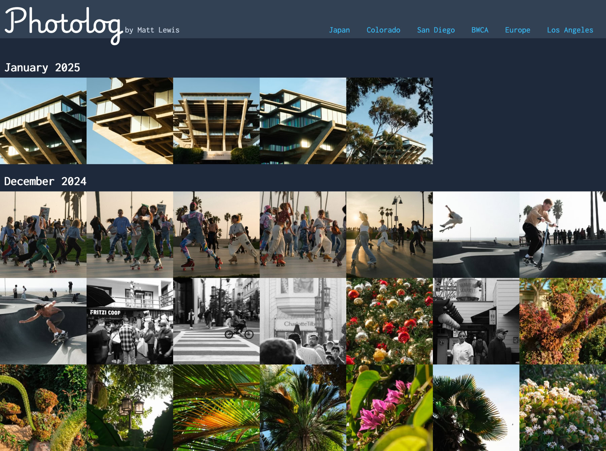
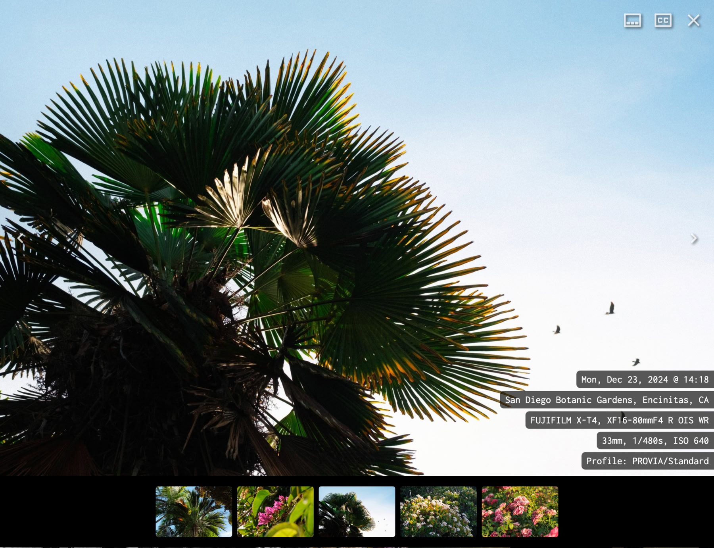

# Photolog

The static site generator I use to share my photos.
[View my live site](https://photolog.mplewis.com/).

[](docs/gallery.jpg)



# Features

- Generated images have a content-based digest URL so your CDN and users'
  browsers can cache them forever
- Multiple resized variants of each photo so visitors can avoid downloading
  oversized images on mobile devices
- Images are compressed to a perceptually lossless level using
  [Jpegli](https://opensource.googleblog.com/2024/04/introducing-jpegli-new-jpeg-coding-library.html)
- Efficient static site output: 93 kB of HTML + CSS + JS gzipped for a gallery
  of 229 photos
- Parses EXIF metadata to include your camera settings (ISO, shutter speed,
  F-stop) alongside each photo
- Support for human-written `Title`, `Caption`, `Sublocation` EXIF fields
  alongside each photo
- [photos.json](https://photolog.mplewis.com/photos.json) API endpoint for
  consumption by social media auto-post bots

# Usage

NOTE: This is a personal project which I use to publish my photos. You're
welcome to fork it and modify it for your own use. If you want me to make this
more of a generic project with friendly parameters and settings,
[let me know!](https://bsky.app/profile/mplewis.com)

## Install Dependencies

Install this third-party software first:

- [Node.js](https://nodejs.org)
- [pnpm](https://pnpm.io)
- [Imagemagick](https://imagemagick.org/)
- [jpegli](https://github.com/google/jpegli)
  - _This software is non-trivial to install on Mac. The Homebrew recipe doesn't
    include the required `cjpegli` binary at this time. Sorry._

Then install JS dependencies:

```sh
cd photolog
pnpm install
```

## Build the Site

Point Photolog to your images using the environment variable:

| Environment Variable     | Description                                   | Example              |
| ------------------------ | --------------------------------------------- | -------------------- |
| `PHOTOLOG_ORIGINALS_DIR` | The directory containing your original images | `/path/to/my/photos` |

Then, run `pnpm build`:

```sh
export PHOTOLOG_ORIGINALS_DIR="/path/to/my/photos"
pnpm build
```

When the build completes, you can find your static site files inside `dist/`.

## Development

To start the local dev server, run `pnpm dev`.

# Photo Structure

Photolog supports a flat pile of photos, or you can assign each photo to an
album:

```
.
├── DSCF8215.jpg
├── DSCF8345.jpg
├── DSCF8349.jpg
├── tokyo
│   ├── DSCF8429.jpg
│   ├── DSCF8504.jpg
│   ├── DSCF8731.jpg
│   └── metadata.yaml
└── osaka
    ├── DSCF1181.jpg
    ├── DSCF1633.jpg
    ├── DSCF9981.jpg
    └── metadata.yaml
```

Album directories must contain a `metadata.yaml` file describing the album's
contents. The description will be displayed when the album is selected for
viewing. Albums are ordered left to right (or top to bottom on mobile) in
ascending `order`.

```yaml
order: 1
name: Tokyo
desc: Beautiful temples, incredible food, and so much nightlife
```

# TODO

- CI/CD
- Get linting working
- Add JPEG XL support
